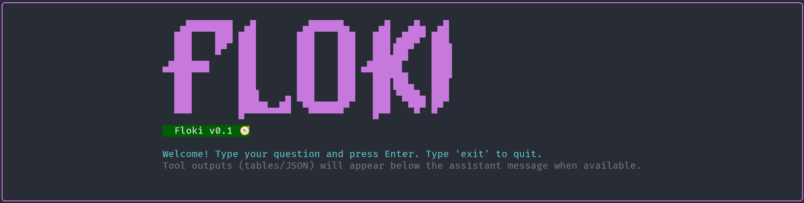

# Floki 🧭 — MLflow Experiment Agentic Chatbot



Floki is named after the legendary Viking engineer Flóki Vilgerðarson, who built innovative boats that enabled Vikings to explore new lands. This project aims to empower ML researchers to explore their experiment logs with the same spirit of discovery.

A CLI-based assistant for ML experimentation, inspired by Claude Code, that helps researchers query, analyze, and gain insights from MLflow experiment logs.

**Quick Setup**

Prerequisites:

- Python 3.10+ or Conda
- Git

1) Create and activate an environment

Option A — Conda (recommended):

```bash
conda env create -f environment.yml -n floki-agent
conda activate floki-agent
```

Option B — venv + pip:

```bash
python -m venv .venv
source .venv/bin/activate
pip install -r requirements.txt
```

2) Add required API keys

Create a `.env` file in the project root or export the variables into your shell. The agent expects at least the following keys:

```
GROQ_API_KEY=your_groq_api_key_here
LANGFUSE_API_KEY=your_langfuse_api_key_here
LANGFUSE_API_URL=https://api.langfuse.com
```

You can also export them directly:

```bash
export GROQ_API_KEY=your_groq_api_key_here
export LANGFUSE_API_KEY=your_langfuse_api_key_here
export LANGFUSE_API_URL=https://api.langfuse.com
```

3) Run the agent or scripts

Start the main agent (project includes `run_agent.sh`):

```bash
bash run_agent.sh
```

